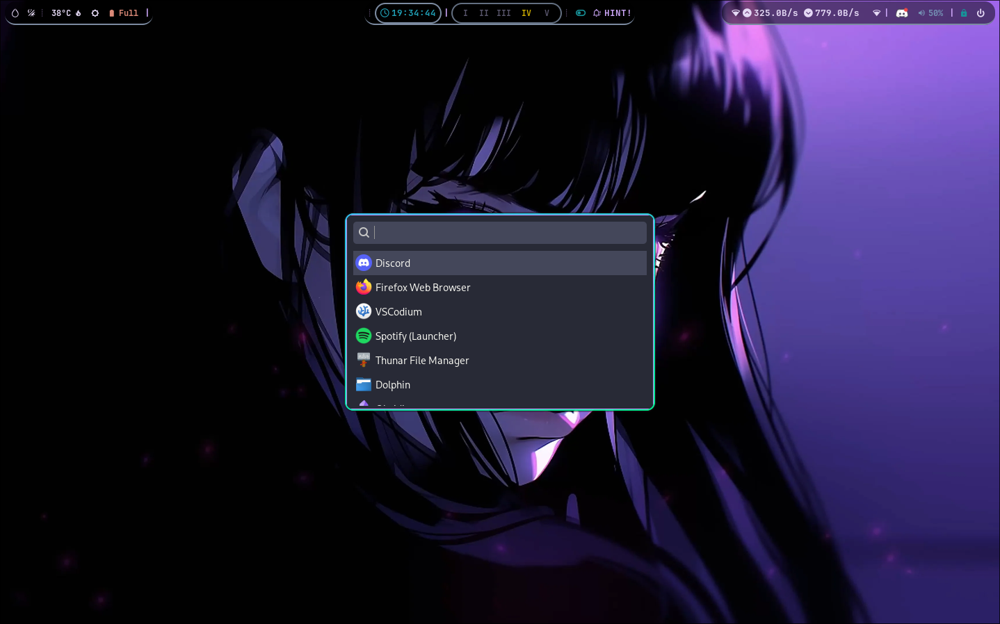

# Default Theme

This set of dotfiles is sourced from various repositories, and not all of them are my original work.

### Maintenance Notice
**This theme is not actively maintained.** If it breaks or becomes incompatible with new updates, you are encouraged to make the necessary updates yourself. If you manage to fix or improve it, consider contributing your changes back to this repository for others to benefit from.

### Note: If your dotfiles are included here, please open an issue so I can credit your repository.

Theme Preview

  
  

Keybinds

I haven't really changed much in the default config file except for some keybinds, so once it's set up, you'll be able to use the following:

| Keybinding         | Action                           |
|--------------------|----------------------------------|
| SUPER + Q          | Execute `alacritty`              |
| SUPER + C          | Kill the active window           |
| SUPER + M          | Exit Hyprland                    |
| SUPER + E          | Execute `thunar`                 |
| SUPER + V          | Toggle floating mode             |
| SUPER + R          | Execute `wofi`                   |
| SUPER + P          | Pseudo                           |
| SUPER + J          | Toggle split mode                |
| SUPER + L          | Execute `wlogout`                |
| SUPER + W          | Execute `switch-wall`            |

### For further customization, check the [hyprland config](config/hypr/hyprland.conf) file or refer to the [Hyprland Wiki](https://wiki.hyprland.org/Configuring/Binds/) for additional keybinds and options.
